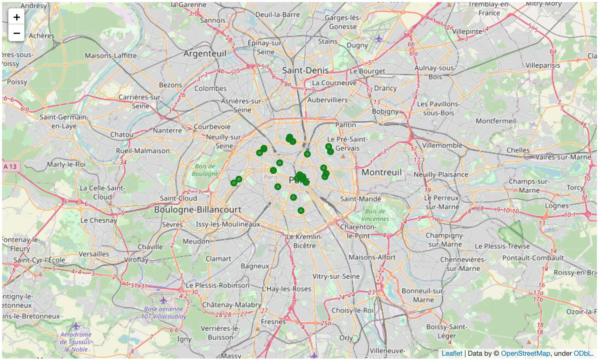

# A Comparison of Museums and Cultural Arts Scenes Between Metropolises

**Introduction**

A small tour-guide company that focuses on museums, historical sites, and the cultural and performing arts is looking to expand by opening a new office in a new city somewhere in the US or Western Europe. From a short list of preferred locations, the company has tasked us to determine in which city is the most appropriate to open an office.

Specifically, between four pre-selected cities (New York, Paris, London, and Toronto), the company would like to know which metropolis has ***(i)*** the highest number of museums, arts centers, and historic sites, ***(ii)*** the highest concentration of museums, as well as in which neighborhoods they are located, and ***(iii)*** a comparison of the surrounding neighborhoods (i.e., what venues are around the museums).

**Describe the data**

To facilitate the client’s request, we leverage data from ***(a)*** Wikipedia, which we scrape to *[i]* find the neighborhood names and addresses for Paris ([link](https://en.wikipedia.org/wiki/Arrondissements_of_Paris)), London ([link](https://en.wikipedia.org/wiki/List_of_areas_of_London)), and Toronto ([link](https://en.wikipedia.org/wiki/List_of_postal_codes_of_Canada:_M)), and *[ii]* find the total area for each city that we used to scale our dataset ([link](https://en.wikipedia.org/wiki/List_of_largest_cities)), ***(b)*** a local JSON file downloaded from Coursera for the neighborhood names and addresses in New York, and ***(c)*** FourSquare's API to search for and download venues in each city's neighborhoods.

**Methodology section**

Using the sources described above, we downloaded the necessary neighborhood names and areas for each city from the web into pandas dataframes, formatting to single out addressess for each neighborhood. Then, utilizing the geocode python library, we determined the geographical coordinates for each city and their respective neighborhoods. 

With the coordinates of each neighborhood from geocode, we accessed FourSquare's API to get all venues within half mile radius. Keeping only the neighborhoods that contained historical sites, museums, and cultural and performing arts centers, we visualized those neighborhoods on a map using the folium library (***Exhibits 1-4***).

**Exhibit 1: New York Neighborhoods with Museums/Arts Centers**

**Exhibit 2: Paris Neighborhoods with Museums/Arts Centers**

**Exhibit 3: London Neighborhoods with Museums/Arts Centers**

**Exhibit 4: Toronto Neighborhoods with Museums/Arts Centers**

Furthermore, we analyzed the aggregate number of museums, historic sites, and arts centers between each city (***Exhibit 5***). 

**Exhibit 5: Absolute Number of Museums/Arts Centers Between Cities**

The natural problem we faced, however, is how do we adjust for differences between cities so that we could analyze on a equal footing? In response, we selected to scale each city by its respective area. That is, we again used Wikipedia to downloaded the area, in squared kilometers, for each city. We then divided the matrix of the aggregate number of museums, historic sites, and arts centers for each city by the vector of each city's square-kilometer area (***Exhibit 6***).

**Exhibit 6: Scaled Number of Museums/Arts Centers Between Cities**

In order to describe the neighborhoods that surround located museums, historical sites, and cultural/performing arts centers in each city, we opted to cluster the neighborhoods based on the venue categories in each. Specifically, we used pandas onehot encoding method to segment the targeted neighborhoods by FourSquare's venue category feature, then ran scikit-learn's k-means clustering algorithm using a k-means equal to five (k=5).

**Results section**

This section, discusses the results of our analysis by each city. 

- New York City

In ***Exhibit 7***, we map New York City's neighborhoods that contain museums/arts centers clustered by the k-means algorithm. We then assessed the aggregate number of museums/arts centers per cluster (***Exhibit 8***), then summarize the categories of the most common venues surrounding each cluster of neighborhoods (***Exhibit 9***). This led us to conclude that NYC has the most number of museums/arts centers concentrated in neighborhood clusters 1 and 3, while the most common venues surrounding those clusters are Italian restaurants, coffee shops, bars, parks, pizza places, Chinese restaurants, and hotels.

**Exhibit 7: New York City's Neighborhood Clusters**

**Exhibit 8: New York City's Number of Museums/Arts Centers Segmented by Neighborhood Cluster**

**Exhibit 9: Summary of New York City's Most Common Venues in Neighborhood Clusters with the Most Museums/Arts Centers**

- Paris

In ***Exhibit 10***, we map Paris' neighborhoods that contain museums/arts centers clustered by the k-means algorithm. We then assessed the aggregate number of museums/arts centers per cluster (***Exhibit 11***), then summarize the categories of the most common venues surrounding each cluster of neighborhoods (***Exhibit 12***). This led us to conclude that Paris' museums/arts centers are fairly evenly spread across neighborhood clusters, with the exception of cluster 4, while the most common venues surrounding those clusters are hotels, French restaurants, and bars.

**Exhibit 10: Paris' Neighborhood Clusters**

**Exhibit 11: Paris' Number of Museums/Arts Centers Segmented by Neighborhood Cluster**

**Exhibit 12: Summary of Paris' Most Common Venues in Neighborhood Clusters with the Most Museums/Arts Centers**

- London

In ***Exhibit 13***, we map London's neighborhoods that contain museums/arts centers clustered by the k-means algorithm. We then assessed the aggregate number of museums/arts centers per cluster (***Exhibit 14***), then summarize the categories of the most common venues surrounding each cluster of neighborhoods (***Exhibit 15***). This led us to conclude that London has the most number of museums/arts centers concentrated in neighborhood clusters 4 and 2, while the most common venues surrounding those clusters are hotels, cafes/coffee shops, and pubs, as well as grocery stores in cluster 4.

**Exhibit 13: London's Neighborhood Clusters**

**Exhibit 14: London's Number of Museums/Arts Centers Segmented by Neighborhood Cluster**

**Exhibit 15: Summary of London's Most Common Venues in Neighborhood Clusters with the Most Museums/Arts Centers**

- Toronto

In ***Exhibit 16***, we map Toronto's neighborhoods that contain museums/arts centers clustered by the k-means algorithm. We then assessed the aggregate number of museums/arts centers per cluster (***Exhibit 17***), then summarize the categories of the most common venues surrounding each cluster of neighborhoods (***Exhibit 18***). This led us to conclude that Toronto has the most number of museums/arts centers concentrated in neighborhood clusters 3 and 2, while the most common venues surrounding those clusters are coffee shops, cafes, and hotels.

**Exhibit 16: Toronto's Neighborhood Clusters**

**Exhibit 17: Toronto's Number of Museums/Arts Centers Segmented by Neighborhood Cluster**

**Exhibit 18: Summary of Toronto's Most Common Venues in Neighborhood Clusters with the Most Museums/Arts Centers**

**Discussion section**

After comparing the results of each city by scaling the number of venues per square-kilometer, we observe that New York City has the highest number of art galleries and performing arts venues, while Paris has the highest number of art museums and was a close second to New York City in art galleries. Paris also led the group in museums, public arts, and science museums.

Given clusters of surrounding neighborhoods, we also observe that New York City's museums/arts centers are mostly centered in the tourist areas of Manhattan, with hotels, coffee shops/cafes, restaurants and bars appearing as some of the most recurring venues (albeit, the dispersion of venues is wide in New York). Paris' museums/arts centers are pretty evenly spread out among neighborhood clusters. Venues in London are also spread out geographically, but are clustered in two types of neighborhoods; interestingly, one of those neighborhoods appears to have a residential tilt to it (e.g., there is a high number of grocery stores, bus stations, and parks). The museum/arts scene in Toronto, while also centered in downtown and tourist areas, is, however, much smaller the other cities under consideration, suggesting the investment may not be worth the return. 

CONCLUSION: Based on these findings, we recommend our client is best suited to expand in New York City, with our fallback recommendation being Paris.

